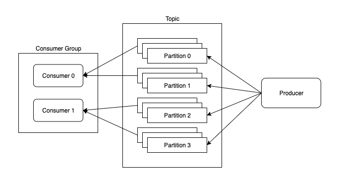
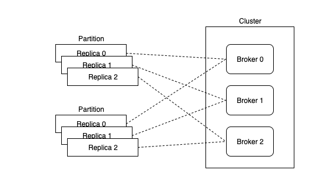

# kafka-java-client

## Requirements

- Java 11
- Gradle 6
- Kafka 2.4.0

## Architecture

This project consists of:

- A cluster of three Kafka brokers
- One consumer group, consisting of two Kafka consumers
- One Kafka console producer

A topic is a message log that's split into `P` partitions, each partition having `N` replicas. Each message in the log is identified by an offset. Messages are appended to these partitions by a producer. The producer decides to which partition it will send each new message based on some partition function [[src](https://kafka.apache.org/intro#intro_producers)]. A consumer group is a group of consumer processes that subscribes to one or more topics. Each member of the group gets exclusive access to a fair share of the partitions of the topic [[src](https://kafka.apache.org/intro#intro_consumers)]. But by ensuring that for every partition, there exists a consumer listening to it, the consumer group as a whole can access the messages from all partitions of the topic.

When a consumer of a group is closed or crashes, the consumer group (through its coordinator) will reassign the partitions to the remaining consumers of that group. This is called rebalancing.

To keep track of which messages of the topic have been read, each consumer stores the log offset of the latest message that it has read through an "offset commit". This can either be done manually through the Java client API or configured to be done automatically after a fixed interval of time. A manual commit is preferred, to avoid the possibility of missing or duplicated messages [[src](https://www.oreilly.com/library/view/kafka-the-definitive/9781491936153/ch04.html#idm45788273433576)].



Each partition of a topic is duplicated into `N` replicas. These replicas are distributed such that no two replicas reside on the same broker. That means there must be at least `N` brokers in the cluster. For each partition, one replica is chosen as the leader and the others, as followers. All reads and writes are performed on the leader and the followers keep in sync with the leader. At any given moment, for a given partition, the subset of followers that are in sync with the leader are called the "in-sync replicas" (ISR) of that partition. A broker may house a leader replica of one partition and a follower replica of another partition.



## Setup

Download the Kafka 2.4.0 tarball (download [here](https://www.apache.org/dyn/closer.cgi?path=/kafka/2.4.0/kafka_2.12-2.4.0.tgz)) and extract it. Then place its `bin/` directory in the `$PATH` environment variable to expose the ZooKeeper and Kafka scripts that are used in the instructions below. Alternatively, you can write down the absolute path to these scripts if you don't wanna pollute your `$PATH`.


All of these are configured in the project's `src/main/resources/*.properties` files.

## Run

Most of these instructions mirror those given in the [Kafka Quickstart page](https://kafka.apache.org/quickstart).

### TLDR

- Spin up the ZooKeeper server and Kafka brokers
- Create a topic of 4 partitions and a replication factor of 3 (one per broker)
- Start up the two Java client consumers that will be subscribed to this topic. They will keep polling the brokers for messages from the topic.
- Using a console producer, send messages to the topic. The Java client consumers will receive the messages and will print them to their console.

### Detailed Instructions

Start the quick-and-dirty single-node ZooKeeper instance provided within the extracted Kafka directory.

```
$ zookeeper-server-start.sh <path/to/kafka/dir/>/config/zookeeper.properties
```

Now, ensure that your `pwd` is the project's `src/main/resources` for the rest of the instructions.

Start the three Kafka brokers in parallel.

```
$ kafka-server-start.sh broker0.properties
$ kafka-server-start.sh broker1.properties
$ kafka-server-start.sh broker2.properties
```

Create a topic called `test-topic` with 4 partitions and a replication factor of 3 (one per broker). Through the `--bootstrap-server` argument, we have to provide the URL of any one of the brokers in the cluster.

```
$ kafka-topics.sh --create \
    --topic test-topic \
    --replication-factor 3 \
    --partitions 4 \
    --bootstrap-server localhost:3001
```

`cd` into the root directory of the project and start the Java client Kafka consumers. The consumers will be run in their own individual threads. Both of them belong to the same consumer group.

```
$ ./gradlew run
```

Start a console producer that will send messages to the topic `test-topic`. Again, provide the URL of any broker in the cluster. Then send some messages.

```
$ kafka-console-producer.sh \
    --topic test-topic \
    --broker-list localhost:3001
> message one
> message two
```

### Other Commands

List all the topics in the cluster. Provide any one broker's URL.

```
$ kafka-topics.sh --list --bootstrap-server localhost:3001
```

Describe a topic that's in the cluster. Here's the command along with the expected output.

```
$ kafka-topics.sh --describe \
    --topic test-topic \
    --bootstrap-server localhost:3001
Topic: test-topic	PartitionCount: 4	ReplicationFactor: 3	Configs: segment.bytes=1073741824
	Topic: test-topic	Partition: 0	Leader: 1	Replicas: 1,0,2	Isr: 1,0,2
	Topic: test-topic	Partition: 1	Leader: 0	Replicas: 0,2,1	Isr: 0,2,1
	Topic: test-topic	Partition: 2	Leader: 2	Replicas: 2,1,0	Isr: 2,1,0
	Topic: test-topic	Partition: 3	Leader: 1	Replicas: 1,2,0	Isr: 1,2,0
```

Delete a topic of the cluster.

```
$ kafka-topics.sh --delete \
    --topic test-topic \
    --bootstrap-server localhost:3001
```
